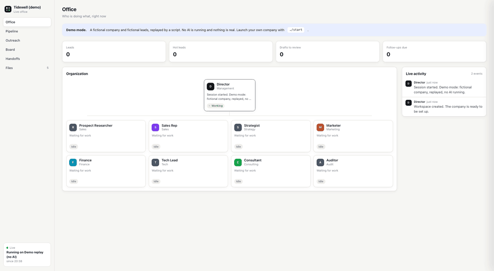
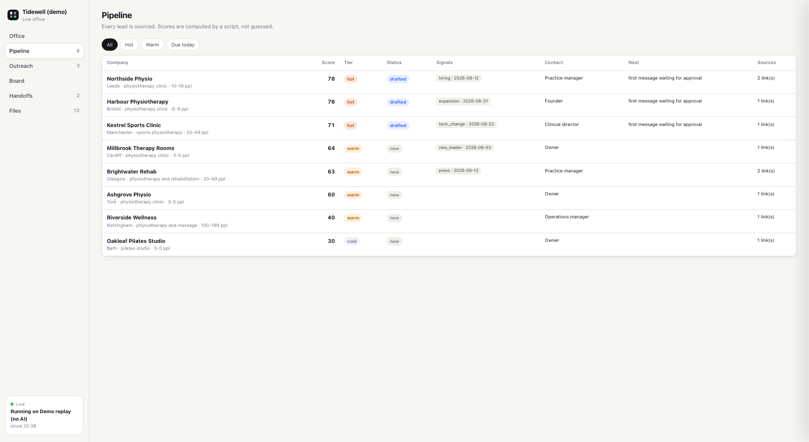
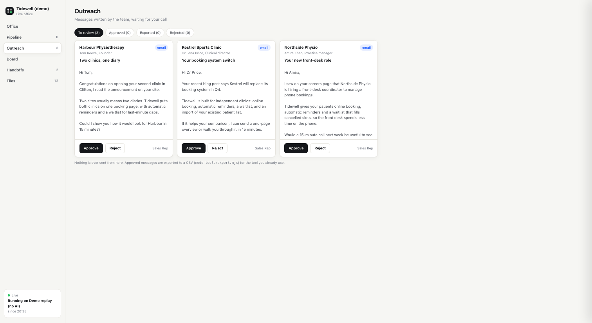

# Open Company

[](https://github.com/youdcode/open-company/actions/workflows/test.yml)

**A company that runs in a folder. Bring the AI you already pay for.**

Open Company is a ready-made team of AI roles (a Director, a Prospect Researcher, a Sales Rep,
a Strategist, a Marketer, Finance, a Tech Lead, a Consultant and an Auditor) that lives in plain
files on your computer. You open the folder with the AI coding tool you already use, and a live
office opens in your browser so you can watch the team work.

Its first job is **prospecting**: finding companies that fit your offer, proving it with sources,
and writing short personal messages that you approve before anything goes out.



<sub>Demo mode (`./start --demo`): a fictional company and fictional leads replayed by a script, sped up.
No AI was running for this recording.</sub>

- **No API key, no extra bill.** It runs inside Claude Code, Codex or other agent tools, logged in
  with your own plan.
- **Not tied to one AI.** The company is written in open formats (`AGENTS.md`, `SKILL.md`). The AI is
  just the engine you plug in.
- **Every fact has a source.** The rules are enforced by scripts, not only by prompts: a lead without
  a source is rejected, a contact without the page where it was found is rejected, scores are computed
  by code.
- **Nothing is sent without you.** The team drafts, you approve in the live office, you export and
  send with your own tools.
- **Your data stays on your computer.** Everything the company produces lives in `workspace/`, which is
  never committed.

## See it first, without any AI

```bash
git clone https://github.com/youdcode/open-company.git
cd open-company
./start --demo
```

The live office opens and replays one minute of a fictional company at work: the researcher finds and
scores 8 clinics, the sales rep drafts 3 messages, the auditor checks them. Everything is invented
(all links use the reserved `.example` domain), nothing is sent, and it costs nothing. You can click
Approve or Reject at the end.

## Quick start

You need [Node.js](https://nodejs.org) 20+ and one supported AI tool, installed and logged in.
Check your setup any time with `./start --doctor`.

```bash
git clone https://github.com/youdcode/open-company.git
cd open-company
./start            # Windows: start.cmd
```

`./start` opens the live office at http://localhost:4747 with a **Chat** tab. Write to "the right
person" and the CEO decides who handles it, or pick one role (Marketing, Sales, Finance...) and talk to
it directly. You see the roles hand work to each other in the conversation, and each answer is signed
by the role that gives it. The page is in English or French (switch at the bottom left). The AI tools installed on your computer are listed in
the chat (Claude Code, Codex, OpenCode), and you can switch between them. On the first run, click
`setup`: the Director interviews you for a few minutes. Then you can type:

| Type | What happens |
|---|---|
| `prospect 10` | The researcher finds 10 companies that fit, each verified and sourced |
| `qualify` | Dated buying signals and a published contact route, then scoring |
| `draft` | The sales rep writes first messages for the best leads |
| `followups` | Today's follow-ups, drafted |
| `replies` | Reads the reply emails you dropped in the inbox folder and updates the leads |
| `brief Acme` / `proposal Acme` | Meeting brief, then proposal with its quote |
| `quote for Acme` / `invoice Acme` | Quote or invoice draft with exact totals, issued by you |
| `one-pager clinics` | One-page presentation of your offer for a segment |
| `status` | Pipeline and board in six lines |
| `sprint "launch in Belgium"` | The whole company works on one goal, the auditor reviews |
| `export` | Approved messages go to a CSV for your own email tool |

Prefer the terminal? `./start --terminal` runs the AI tool in the terminal instead, and the page still
shows everything. You can also open the folder directly with your AI tool (`claude`, `codex`,
`opencode`, `agy`) and type `start`.

Each chat message runs your AI tool in this folder in headless mode, with your own login, and continues
the same conversation. Log in to your AI tool once in a terminal before the first chat.

**Leave and come back.** A request runs on your computer's server, not in the page: switch tabs, reload
or close the page, and find the work in progress or the answer when you come back. Turn on "Notify me"
to get a notification when the team has answered. **Dictation**: the microphone button uses your
browser's speech recognition (Chrome, Edge, Safari).

**The team talks.** When several roles are involved, they discuss in short messages you read live:
proposals, objections, answers, then a decision. In a real test, Marketing wanted to promise fewer
no-shows, Sales objected that the company profile forbids it, and the CEO decided.

**Artifacts.** Ask for "an interactive prospecting file", a dashboard or a comparison table: the team
delivers it in the Artifacts tab (and as a card in the chat). The prospecting file is built from the real
data by a script: search, filters, sort, sources, draft messages, your notes, CSV export. Artifacts run
in a sandbox: they cannot read your data or talk to your team.

**It remembers.** Everything that matters lives in files inside `workspace/`: leads, drafts, documents,
artifacts, the board, the journal, and `org/memory.md` for lasting facts and your preferences. Close
everything, come back tomorrow: the team reads its memory, the journal and the board at the start of
every session and picks up where it stopped. A conversation is cheap to end and free to restart, which
is also how you keep your AI usage low: end the day, start a new conversation, the facts stay.

**It can learn your own documents.** Add a folder under "Readable folders", then say "read my documents":
the team writes a knowledge base in `workspace/company/knowledge/` (an index plus digests, every fact
pointing to the file it came from), and reads the index at every session start.

**Readable folders.** The team only reads this project. To let it learn from your own documents (a
company handbook, a business plan...), add the folder under "Readable folders" in the chat: the team can
read it, never write in it (tested with Claude Code). What it reads is sent to your AI tool.

## Supported AI tools

| AI | Tool | How you pay | Status |
|---|---|---|---|
| Claude | [Claude Code](https://code.claude.com) | your Claude plan | tested: every command, in real runs |
| ChatGPT | [Codex CLI](https://learn.chatgpt.com/docs) with "Sign in with ChatGPT" | your ChatGPT plan | tested: setup, real prospecting with web search and the registers, scoring, drafts, handoffs |
| Free, no account | [OpenCode](https://opencode.ai) with its free models | nothing | tested: setup, leads, scoring, drafts, handoffs (see the note below) |
| DeepSeek, local models, others | [OpenCode](https://opencode.ai) | the provider's API key, or free local models | same tool as above; these providers not tested |
| Gemini | [Antigravity CLI](https://antigravity.google) | free Google account (limited weekly quota) or a Google plan | configured from the official docs, not yet tested |

**No AI subscription at all?** OpenCode's free models answer without an account (`./start opencode`,
then pick a free model with `/models`). Two things to know: they are offered on a best-effort basis
(during our tests one of them did not answer for several minutes), and the data you send them may be
used to improve the model. Use them to try Open Company, not with real prospect data.

Perplexity is a search engine rather than an agent tool. It can be plugged in later as a search
source through its API (paid).

Results depend on the model. In our tests every AI respected the rules the scripts enforce (no lead
without a source, computed scores), but judgment differed: for example, one AI kept a bakery that
another had excluded because it already took online orders. That is one reason the important rules
are enforced by scripts, and why you approve everything. Reports from people testing other tools are very welcome.

## The live office

A local web page that shows:

- **Office**: the organization chart, who is working right now, and a live activity feed
- **Chat**: talk to the whole team or to one role; the team's discussion, handoffs and each action appear as they happen (the only tab that uses your AI)
- **Artifacts**: interactive pages, tables and files the team made for you
- **Pipeline**: every lead with its score, signals, next action and sources
- **Outreach**: drafted messages with Approve and Reject buttons
- **Finance**: quotes and invoices; you issue them (which gives the next number), mark them paid, print to PDF
- **Board**: tasks across the company (Todo, Doing, Review, Done)
- **Handoffs**: the short notes the roles pass to each other
- **Files**: everything the company has produced





It listens on `127.0.0.1` only and refuses requests from other websites. Run it alone with
`./start --viewer-only`. Add `?theme=light` or `?theme=dark` to the address to force a theme.

## How it works

```
 you ──> your AI tool (Claude Code, Codex, OpenCode, Antigravity)
             │ reads
             ▼
         AGENTS.md ............ the Director's manual: commands, team, protocol, rules
         roles/*.md ........... one brief per role (single source of truth)
         .agents/skills/ ...... playbooks: setup, prospect, qualify, draft-outreach, follow-ups, sprint
             │ runs
             ▼
         tools/*.mjs .......... scripts that enforce the rules and write the shared files
             │ write
             ▼
         workspace/ ........... leads.csv, account files, drafts, board, handoffs, events
             │ watched by
             ▼
         viewer/ .............. the live office at http://localhost:4747
```

- The roles talk through files: a task board, short handoff notes, and an event log. Any AI tool can
  follow that protocol, and you can read all of it.
- `npm run sync` turns `roles/*.md` into each tool's native subagent format (`.claude/agents`,
  `.codex/agents`, `.opencode/agents`, `.agents/agents`) and mirrors the skills for Claude Code.
- Zero dependencies: plain Node.js scripts and one HTML file.

## Rules enforced by code

| Rule | Where |
|---|---|
| No source, no lead | `tools/leads.mjs` rejects leads without an http(s) source |
| No guessed contacts | a contact name or channel requires `contact_source` |
| Dated signals only | signals must look like `hiring@2026-09-02` |
| Scores are computed, not invented | `tools/score.mjs`, from the rules in your `icp.md` |
| Nothing sent without you | drafts need approval; `tools/export.mjs` only writes a CSV |
| Opt-outs are final | no draft for a lead marked `do_not_contact` |
| Short handoffs | `tools/handoff.mjs` refuses long messages |
| Only a human issues a quote or an invoice | `tools/invoice.mjs` has no issue command; the Finance tab does it, with an unbroken numbering |
| Exact totals | amounts in cents, VAT per line, computed by the script |
| Opt-out replies are applied | `tools/replies.mjs` marks "please stop" replies `do_not_contact` |
| Safe parallel work | shared files are locked, so agents working at the same time never lose a line |

The other rules (primary sources, no LinkedIn scraping, minimal personal data, no invented claims)
are in `AGENTS.md` and checked by the Auditor.

## Data sources and replies

- **Official company registers**, free, with a source link per company and birth dates removed:
  France (no key), Norway (no key), United Kingdom (free key). See [docs/search-sources.md](docs/search-sources.md).
- **Perplexity** or another search engine can be added as an optional, paid search source
  ([how](docs/search-sources.md)).
- **Replies** without giving anyone your mailbox password: save or drag reply emails as `.eml` files
  into `workspace/prospecting/inbox/`, then type `replies`. Each reply is matched to its lead; a reply
  asking you to stop marks the lead `do_not_contact`.

## Usage limits

Your AI plan has usage limits shared with everything else you do. A multi-role run uses more than
a chat. To spend less, the company:

- gives each role a short brief and asks for 10-line reports
- does mechanical work (scoring, exporting, counting) in scripts
- stops searching once the target is reached
- routes simpler roles to lighter models where the tool allows it (see `tier` in `roles/*.md`)

Start with small batches (`prospect 5`) to see what your plan allows.

## What runs on your computer

- `./start`: prepares `workspace/`, serves the live office and its chat. Each chat message starts your AI
  tool in this folder (headless) with the same limited permissions as below.
- `./start --demo`: replays a fictional session in `.demo/` (recreated each time, never committed).
- Session hooks (`.claude/settings.json`, `.codex/hooks.json`): run `node viewer/ensure.mjs`, which
  starts the live office if it is not running. That is all they do. When you open the folder
  interactively for the first time, your AI tool asks whether you trust it.
- Permissions: the project allows the AI to write in `workspace/`, run `node tools/...`, and search the
  web. Everything else asks you first. These project permissions only apply once you have accepted
  your tool's "trust this folder" prompt, so run `./start` (interactive) the first time rather than a
  headless command.
- No telemetry. Nothing is sent anywhere except the web searches your AI tool makes and, for French
  companies, queries to the official public registry.

## Prospecting and the law

You are responsible for how you contact people. In the European Union, the GDPR applies to data about
people, including business contacts, and some countries add rules on commercial email. In France,
for example, the CNIL allows B2B prospecting emails without prior consent when the message relates to
the person's job, as long as they are informed and can object easily. The drafts include an opt-out
line for this reason. Check the rules of your country.

## Customize

- Change a role: edit `roles/<role>.md`, then `npm run sync`.
- Change a playbook: edit `.agents/skills/<name>/SKILL.md`, then `npm run sync`.
- Add a data source: add a script in `tools/` and mention it in `AGENTS.md`.
- Run the checks: `npm test` (add `-- --online` to also query the registry).

## Roadmap

- Test Antigravity
- More official company registers (Belgium, Germany, Spain...)
- Optional direct mailbox connection (IMAP, read-only) for replies
- Credit notes, and export of issued invoices for your accountant

## Not affiliated

Open Company is an independent project. It is not affiliated with or endorsed by Anthropic, OpenAI,
Google, DeepSeek, Perplexity or the makers of OpenCode. Product names belong to their owners.

## License

MIT
